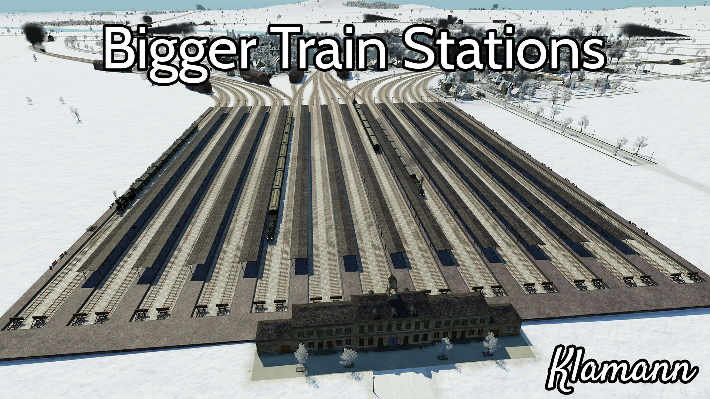

# Bigger Stations

This is a mod for the game [Transport Fever](http://www.transportfever.com/). It adds more options to the train stations available in the game, like more tracks and longer platforms.

## About

For a detailed description, see [Workshop.md](./Workshop.md).

You can get a copy of the mod from [transportfever.net](https://www.transportfever.net/filebase/index.php/Entry/2683-Gr%C3%B6%C3%9Fere-Bahnh%C3%B6fe/) or the [Steam Workshop](http://steamcommunity.com/sharedfiles/filedetails/?id=853048846).

To get support, please visit [this thread on transportfever.net](https://www.transportfever.net/index.php/Thread/7379-Gr%C3%B6%C3%9Fere-Bahnh%C3%B6fe/) (you may comment in german or english).

## Build

Mods for Transport Fever are written in Lua Script and therefore no compilation or other build steps are required. There is however a script that creates a distribution package:

    python package.py

This will create a zip-file with all required files of this mod in the dist-folder.

## License

This software is licensed under the 3-Clause BSD License (see [LICENSE](./LICENSE)).
